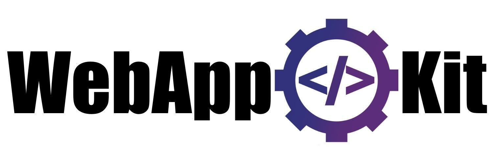

# Web App Kit framework
Little framework to develop prototype of web app who looks like native (Progressive Web App)

​

## What I can do ?

- Manage easily your app screens
- Create custom components with web component

## What I can't do ?

- Nothing at all ! This framework is at the begining, so it has to evolve day after day

---

## Documentation

Using methods when `App` is called :

| Function | Arguments | Types | Description |
| -------- | --------- | ----- | ----------- |
| navigate | screenName | string | Switch into another screen |
| alert | message | string | Display an alert on main screen |
| getResourceURL | name, format | string, FileFormat | Return your resource link |
| addComponent | tag, component | string, string | Define your custom web component in the DOM |

Custom variables you can use :

| Variable | Values |
| ------ | ------ |
| FileFormat | PNG, JPG, GIF |

### Create custom component

In your component script :

```javascript
import { CustomComponent } from "../app/App.js";

const STYLE = `
    color: blue;
`;

class MyComponent extends CustomComponent {
    constructor() {
        super();
        // Add events listener like this.onclick
    }

    render() {
        return `
            <span style="${STYLE}">${this.properties.value}</span>
        `;
    }
}

export {
    MyComponent
};
```

In your screen JavaScript file :

```javascript
import { App } from "./../../app/App.js";
import { CustomButton } from "./../../components/MyComponent.js";

App.addComponent("my-component", CustomButton);
```

In your screen HTML file :

```html
<my-component value="Hello blue text"></my-component>
```

---

## How to use WebAppKit node package ?

- Install the necessary packages

`npm install`

- Initiate a new project

`node wak.js init`

- Create a new screen

`node wak.js ./MyApp screen`

- Create a new component

`node wak.js ./MyApp component`

- Launch your app on your default browser

`node wak.js ./MyApp run`

---

## VSCode extension

*Coming soon*

---

## Progressive web app

You can test your web app like native app just to add it as a shortcut on your mobile home screen, from your actual browser (Safari for iOS and Chrome for Android are recommended)

---

#### __©2023 NanoDév Studio__
